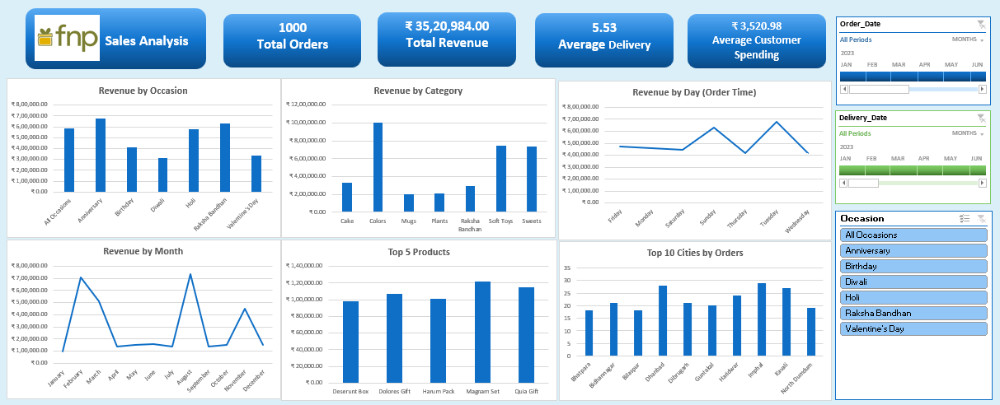
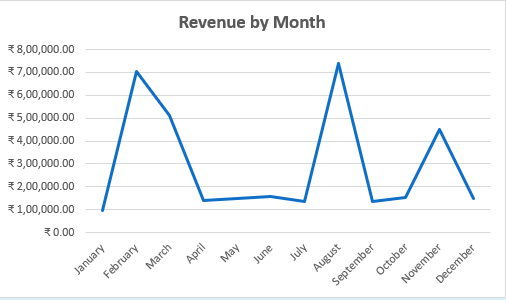
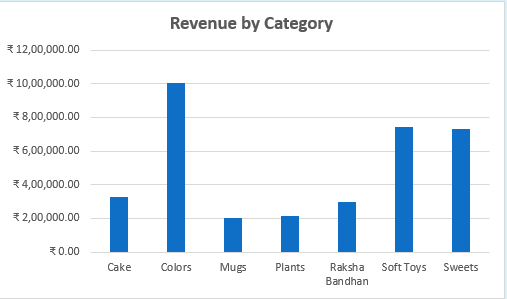
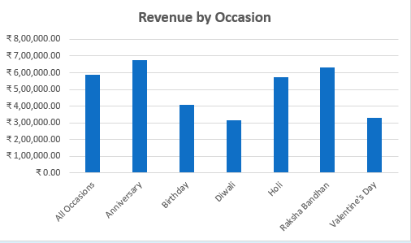
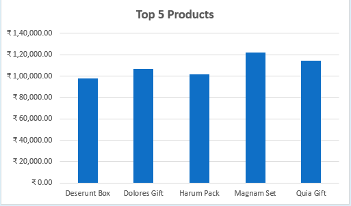
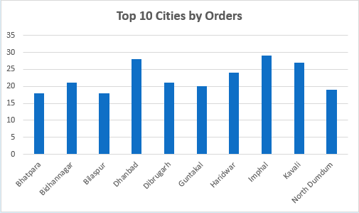

# <h1> FNP | Sales & Customer Analytics</h1>

> **A data-driven analysis of FNP's 2023 sales performance, product demand, customer behavior, and occasion-driven revenue to uncover actionable business insights.**

---

## 📌 Executive Overview

FNP's sales data was analyzed to understand **what drives revenue, which product categories perform best, when customers purchase, and which occasions contribute most to sales**.

The analysis covers:

- **1,000 orders**
- **100 customers**
- **70 products**
- **301 cities**
- **₹35.21L total revenue**
- **₹3,521 average order value**
- **5.53 days average delivery time**

The analysis transforms transactional data into business insights across **sales trends, product categories, occasions, cities, and customer demand**.

---

## 📑 Table of Contents

- Executive Overview
- Dashboard
- Business Questions
- Data Overview
- Sales Performance
- Category Performance
- Occasion Analysis
- Product Performance
- Geographic Analysis
- Key Business Findings
- Recommendations

---

## 📊 Dashboard

The dashboard provides a consolidated view of FNP's sales performance across **time, products, categories, occasions, and locations**.

  

---

## 🎯 Business Questions

The analysis focuses on the following business questions:

1. How does revenue change throughout the year?
2. Which product categories generate the most revenue?
3. Which occasions drive the highest sales?
4. Which products are the strongest revenue contributors?
5. Which cities generate the highest order volumes?
6. What patterns can be identified in customer purchasing behavior?
7. What opportunities exist to improve sales and customer experience?

---

## Data Overview

The analysis combines three core datasets:

| Dataset | Business Use |
|---|---|
| **Orders** | Transaction-level sales, order and delivery analysis |
| **Customers** | Customer demographics and customer information |
| **Products** | Product, category, price and occasion information |
| **Pivot Table** | Consolidated analytical summaries |

### Key Fields

`Order ID` · `Customer ID` · `Product ID` · `Quantity` · `Order Date` · `Delivery Date` · `Location` · `Occasion` · `Category` · `Product Name` · `Price` · `Revenue`

---

# Sales Performance

FNP generated **₹35.21L in revenue across 1,000 orders** during 2023.

### Monthly Revenue

| Month | Revenue |
|---|---:|
| August | ₹7.37L |
| February | ₹7.05L |
| March | ₹5.12L |
| November | ₹4.49L |
| June | ₹1.58L |
| October | ₹1.52L |
| May | ₹1.50L |
| December | ₹1.50L |
| April | ₹1.40L |
| September | ₹1.37L |
| July | ₹1.36L |
| January | ₹0.95L |

  

### Finding

**August generated the highest monthly revenue at ₹7.37L**, followed by February at ₹7.05L.

Together, these two months contributed approximately **41% of annual revenue**, indicating significant concentration around specific periods of customer demand.

---

# Category Performance

Product categories show substantial differences in their contribution to overall revenue.

| Category | Revenue |
|---|---:|
| Colors | ₹10.06L |
| Soft Toys | ₹7.41L |
| Sweets | ₹7.34L |
| Cake | ₹3.30L |
| Raksha Bandhan | ₹2.97L |
| Plants | ₹2.12L |
| Mugs | ₹2.01L |

  

### Finding

**Colors generated the highest revenue at ₹10.06L**, contributing approximately **28.6% of total revenue**.

Soft Toys and Sweets followed with ₹7.41L and ₹7.34L respectively.

The top three categories together generated approximately **70% of total revenue**.

---

# Occasion Analysis

Occasion-based purchasing represents an important part of FNP's sales model.

| Occasion | Revenue |
|---|---:|
| Anniversary | ₹6.75L |
| Raksha Bandhan | ₹6.32L |
| All Occasions | ₹5.86L |
| Holi | ₹5.75L |
| Birthday | ₹4.08L |
| Valentine's Day | ₹3.32L |
| Diwali | ₹3.14L |

  

### Finding

**Anniversary orders generated the highest occasion-based revenue at ₹6.75L**, closely followed by Raksha Bandhan at ₹6.32L.

The top four occasions — Anniversary, Raksha Bandhan, All Occasions, and Holi — generated approximately **65% of total revenue**.

---

# Product Performance

The analysis identifies the products contributing the most revenue.

### Top 5 Products

| Product | Revenue |
|---|---:|
| Magnam Set | ₹1.22L |
| Quia Gift | ₹1.14L |
| Dolores Gift | ₹1.07L |
| Harum Pack | ₹1.02L |
| Deserunt Box | ₹0.98L |

  

### Finding

**Magnam Set generated the highest product-level revenue at ₹1.22L**, followed by Quia Gift at ₹1.14L.

The top five products collectively generated approximately **₹5.42L**, representing around **15% of total revenue**.

---

# Geographic Analysis

Orders were distributed across **301 cities**, providing a broad view of customer demand across locations.

### Top Cities by Order Volume

| City | Orders |
|---|---:|
| Ghaziabad | 9 |
| Bareilly | 9 |
| Bhilai | 8 |
| Darbhanga | 7 |
| Sirsa | 7 |
| Bulandshahr | 7 |
| Ozhukarai | 7 |
| Varanasi | 7 |
| Alwar | 7 |
| Satara | 7 |

  

### Finding

**Ghaziabad and Bareilly recorded the highest order volumes with 9 orders each**, while the top 10 cities collectively accounted for **75 orders**.

The wide geographic spread suggests that FNP's demand is distributed across a large number of markets rather than being concentrated in only a few cities.

---

# Delivery Performance

Average delivery time across the analyzed orders was:

### **5.53 Days**

Delivery performance is particularly relevant for an occasion-based business, where timely fulfillment can directly influence customer experience.

### Finding

Monitoring delivery duration alongside **occasion, city, and order volume** can help identify markets or periods where operational capacity may need additional attention.

---

# Day-of-Week Performance

Revenue varied across the days of the week.

| Day | Revenue |
|---|---:|
| Tuesday | ₹6.77L |
| Sunday | ₹6.28L |
| Friday | ₹4.75L |
| Monday | ₹4.62L |
| Saturday | ₹4.45L |
| Thursday | ₹4.18L |
| Wednesday | ₹4.15L |

### Finding

**Tuesday generated the highest revenue at ₹6.77L**, followed by Sunday at ₹6.28L.

These patterns can be monitored alongside marketing campaigns and promotional activity to understand whether specific days consistently generate stronger demand.

---

# Key Business Findings

- **Revenue is concentrated in a few categories:**

**Colors, Soft Toys, and Sweets generated approximately 70% of total revenue**, making these categories major contributors to overall sales.

- **Occasion-driven demand is significant:**

Anniversary and Raksha Bandhan generated the highest occasion-based revenue, highlighting the importance of occasion-led purchasing.

- **Revenue peaks are highly seasonal:**

August and February recorded the highest monthly revenue, together contributing approximately **41% of annual sales**.

- **A small group of products drives meaningful revenue:**

The top five products generated approximately **₹5.42L**, providing a focused group for inventory and promotional monitoring.

- **Demand is geographically broad:**

Orders were distributed across **301 cities**, indicating a broad customer footprint rather than dependence on a small number of locations.

- **Delivery performance is an important operational metric:**

With an average delivery time of **5.53 days**, delivery efficiency should be monitored alongside high-demand periods and occasion-based orders.

---

# Recommendations

### Strengthen High-Performing Categories

Prioritize inventory availability and promotional visibility for **Colors, Soft Toys, and Sweets**, which together contribute approximately 70% of revenue.

### Plan Around Seasonal Demand

Use historical sales patterns to increase inventory and operational readiness ahead of high-performing periods such as **August and February**.

### Build Occasion-Specific Campaigns

Develop targeted campaigns around **Anniversaries, Raksha Bandhan, and Holi**, which represent some of the strongest revenue-generating occasions.

### Monitor High-Performing Products

Ensure consistent availability of products such as **Magnam Set, Quia Gift, and Dolores Gift**, while evaluating their demand patterns during major occasions.

### Optimize City-Level Operations

Use city-level order trends to identify locations with recurring demand and align inventory, delivery capacity, and promotional activity accordingly.

### Monitor Delivery Performance

Track delivery times by **city, occasion, and demand period** to identify operational bottlenecks and improve the customer experience.
